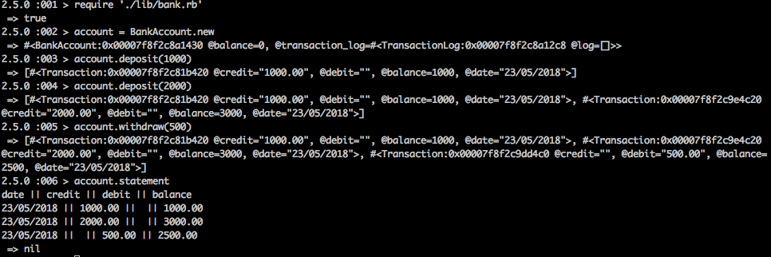

# Bank tech test
-----

### Technologies used:
-----
* Ruby 2.5.0
* Rspec
* Rubocop
* Simplecov

### Challenge
-----
* You should be able to interact with with your code via a REPL like IRB or the JavaScript console. (You don't need to implement a command line interface that takes input from STDIN.)
* Deposits, withdrawal.
* Account statement (date, amount, balance) printing.
* Data can be kept in memory (it doesn't need to be stored to a database or anything).

### Acceptance criteria
-----
**Given** a client makes a deposit of 1000 on 10-01-2012  
**And** a deposit of 2000 on 13-01-2012  
**And** a withdrawal of 500 on 14-01-2012  
**When** she prints her bank statement  
**Then** she would see

```
date || credit || debit || balance
14/01/2012 || || 500.00 || 2500.00
13/01/2012 || 2000.00 || || 3000.00
10/01/2012 || 1000.00 || || 1000.00
```
### Installation
-----
```
> git clone https://github.com/andyk144/bank.git
> cd bank
> bundle install
```
### Run tests
-----
```
> cd bank
> rspec
```

### Run code
-----
irb
```
> require './lib/bank.rb'
> account = BankAccount.new
> account.deposit(1000)
> account.deposit(2000)
> account.withdraw(500)
> account.statement
```


### My approach
-----
I started with a single class, TDDing the first set of features, depositing money and withdrawing money. I then introduced the bank statement feature and once I had it working in the BankAccount class I decided to refactor the code in to separate classes. I started by creating a transaction class, which creates an object for each transaction. I then followed this by creating a transaction log class to hold all of the transactions and produce the statement in a printable format.

I tried to keep my methods as short and easy to understand as possible. I also tried to focus on the messages passing between objects as opposed to the objects defining my messages. This is my first attempt at looking at things this way and there's definitely room for improvement.   
